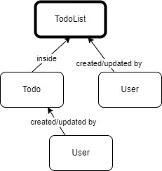

# Component Catalog

Within the intricate world of Evento applications built on the Evento framework, components act as the workhorses. These components handle the heavy lifting of processing events, responding to commands, and generating data. The Evento GUI's Component Catalog serves as a comprehensive guide, allowing you to explore and understand the diverse set of components that make up your distributed system.

#### A Centralized Hub: Exploring the Component Landscape

<figure><figcaption></figcaption></figure>

**Refining Your Exploration: Filter Panels for Focused Discovery**

The Component Catalog doesn't stop at simply presenting the entire list. Recognizing the potential vastness of components in complex systems, the GUI offers additional functionalities to refine your exploration:

* **Filter by Type:** This filter panel allows you to narrow down the displayed components based on their specific type. Selecting a particular type (e.g., "CommandHandler") displays only components that handle commands, facilitating targeted investigation.
* **Filter by Bundle:** This filter panel empowers you to focus on components residing within a specific bundle. Selecting a bundle displays only its components, offering a more granular view of a particular functionality area within your application.
* **Filter by Domain** (might not be present in all versions): This filter panel allows you to concentrate on components associated with a specific domain or functional area of your application. Selecting a domain (if available) displays only components relevant to that section, aiding in understanding how components work together within that domain.

By skillfully utilizing the search bar, filter panels, and the provided component details, you can efficiently navigate and explore the vast collection of components within your Evento application.

#### Beyond the List: Unveiling Component Details

<figure><figcaption></figcaption></figure>

The Component Catalog doesn't merely present a static list. Clicking on a specific component within the table unlocks a new level of detail. This detailed component view delves deeper, revealing:

* **Comprehensive Component Description:** This section provides a more in-depth explanation of the component's purpose and functionality within the system. It might also include details about the payloads it handles (commands, queries) and the events it produces.
* **Payload Interactions:** This section sheds light on how the chosen component interacts with payloads. It might showcase the specific payloads the component can handle and the payloads it generates. Understanding these interactions fosters a deeper understanding of data flow within your application.
* **Configuration Details:** (might not be available in all versions) This section might provide details about the configuration options associated with the component. These configurations could influence the behavior or processing logic of the component, giving you insights into how it's customized within your system.

By delving into the detailed component view, you gain a deeper understanding of each component's role in the intricate dance of processing events, handling commands, and generating responses within your Evento application.

### Telemetry

Telemetry is the process of collecting data from remote sources and transmitting it to a central location for monitoring and analysis. In the context of Evento, telemetry provides insights into the performance and behavior of your application components. By collecting and analyzing telemetry data, you can identify bottlenecks, optimize performance, and ensure the overall health of your system.

#### Aggregate Command Handlers Telemetry

Evento collects telemetry data for command handlers, offering valuable insights into their performance and behavior. This data can be visualized in a chart where you can select the aggregate function, aggregation interval, and time period.

**Key Metrics:**

* **Hit Count:** The total number of times the command handler was invoked.
* **Lock Time:** The time spent waiting for a lock on the aggregate.
* **Retrieve Time:** The time spent retrieving the command state from the event store or snapshots.
* **Service Time:** The effective time spent computing the command.
* **Store Time:** The time spent publishing the event to the Event Store and committing the command.

By analyzing these metrics, you can identify performance bottlenecks, optimize command handler logic, and ensure the overall responsiveness of your application.

<figure><figcaption>
Aggregate Command Handler Teletry Chart
</figcaption></figure>

#### Telemetry for Other Handlers

Evento also collects telemetry data for other types of handlers, such as event handlers and projection updates. The specific metrics collected for these handlers may vary depending on their functionality and purpose.

**Generic Handler Telemetry**

For generic handlers, Evento typically collects the following metrics:

* **Hit Count:** The total number of times the handler was invoked.
* **Service Time:** The average time spent processing the event or update.

These metrics provide a basic understanding of the handler's performance and can be used to identify potential bottlenecks and areas for optimization.

<figure><figcaption></figcaption></figure>

#### Conclusion: The Component Catalog - A Roadmap to System Functionality

The Component Catalog serves as an invaluable asset within the Evento GUI. By offering a comprehensive view of registered components, coupled with search, filter, and detail exploration functionalities, the Catalog empowers you to navigate the intricate functionalities within your distributed system. As you delve deeper into your Evento application, the Component Catalog will remain your trusted roadmap, aiding in understanding component purpose, interactions, and overall system architecture.

The integration of telemetry data further enhances the Component Catalog's utility. By providing insights into component performance and behavior, telemetry empowers you to identify potential bottlenecks, optimize component logic, and ensure the overall health of your system. The Component Catalog becomes not only a structural overview but also a performance diagnostic tool, enabling you to make data-driven decisions to improve your application's efficiency and responsiveness.
