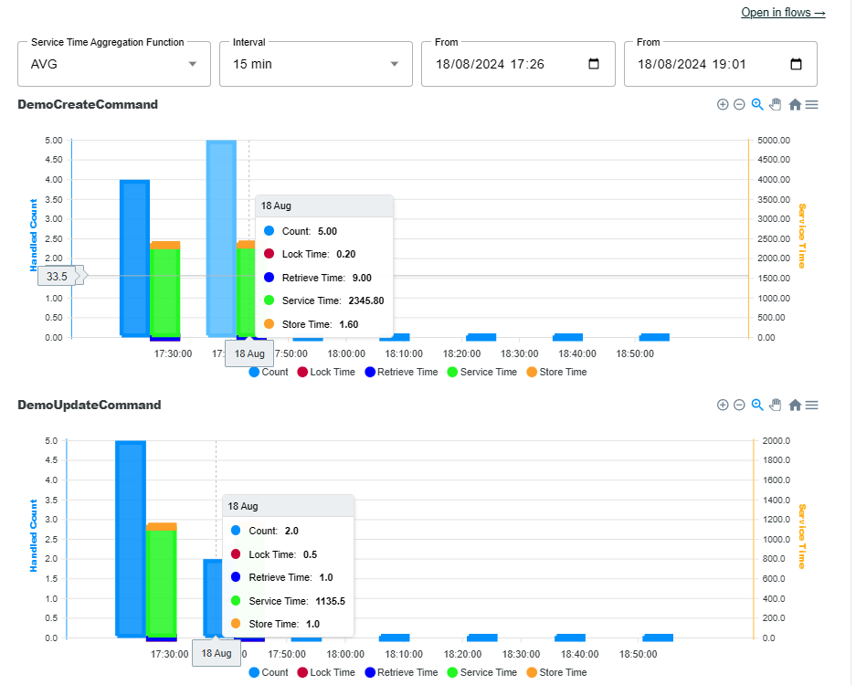

# RECQ System Pattern

The RECQ System Pattern defines the high-level architectural components that make up a RECQ-based application. These components work together to create a modular, scalable, and event-driven system. Here's a breakdown of the key components:

* [**Components**](component.md)**:** These are self-contained units of software that encapsulate specific functionalities of the application. Each component implements a well-defined business logic and interacts with other components through messages. Examples of RECQ components include:
  * **Command Service (Aggregate and Services):** Handles user commands for adding, editing, and deleting data. It publishes events representing these actions.
  * **Query Service (Projector and Projections):** Respond to user queries for retrieving data. It subscribes to relevant events published by the Command Service to keep its data up-to-date.
  * **Domain Logic Components (Invoker, Sagas and Observers):** Implement core business logic of the application and may interact with both Command and Query Services.
* [**Message Gateway:**](message-gateway.md) This component acts as an intermediary for communication between different components within the system. It can handle functionalities like:
  * Routing messages to the appropriate recipient component based on defined rules.
  * Implementing message transformation or validation if needed.
  * Providing a single point of entry for external systems to interact with the RECQ application.
* [**System State Store**](system-state-store.md)**:** This persistent storage mechanism is responsible for storing all the events that occur within the system. It serves as the central repository for the complete history of state changes. Both Command and Query Services can access the Event Store to retrieve historical data or for rebuilding the current state of the application if needed.

<figure><figcaption>
RECQ System Big Picture
</figcaption></figure>

**Communication and Event-Driven Interactions (**[**RECQ Communication Patten**](../recq-communication-pattern/)**):**

* Components in a RECQ system communicate with each other primarily through asynchronous messaging. They publish events representing state changes and subscribe to relevant events published by other components.
* When a component performs an action that modifies the system state, it publishes an event to the Event Store. This event contains details about the change that occurred.
* Other components that are interested in these state changes can subscribe to relevant events. When a new event is published, these subscribing components receive a notification and can update their internal state accordingly. This event-driven approach promotes loose coupling between components and enables them to react asynchronously to changes in the system.

**Benefits of the RECQ System Pattern:**

* **Modularity and Scalability:** By breaking down the application into independent components, the system becomes more modular and easier to scale. Individual components can be scaled independently based on their specific load requirements.
* **Maintainability:** Clear separation of concerns makes the application easier to understand, maintain, and modify.
* **Resilience:** Asynchronous communication and event-driven architecture make the system more resilient to failures. If one component fails, it doesn't necessarily bring down the entire system. Other components can continue to operate based on the events they have already received.

**Beyond the Basics:**

While the core RECQ System Pattern defines these essential components, additional considerations can be factored into the design:

* **API Gateway:** An API Gateway can be introduced as a single entry point for external clients to interact with the microservices within the RECQ system.
* **Circuit Breaker Pattern:** Implementing circuit breaker patterns can improve fault tolerance by handling failing services gracefully.
* **Security Mechanisms:** Security considerations like authentication and authorization need to be addressed when designing the communication between components.

**Conclusion:**

The RECQ System Pattern provides a solid foundation for building event-driven, scalable, and maintainable microservices architectures. By understanding the core components and their interactions, developers can design robust applications that can handle the demands of modern software systems.

> RECQ system is a set of computational units called components which they communicate with each other by exchanging messages; if a component has a consequence the system state changes, this information is published as an event in the System State Store, and components can listen for changes of the system state to change their internal state without an explicit message from of another component.

<figure><figcaption>
Sample interaction of modules in a RECQ System
</figcaption></figure>
